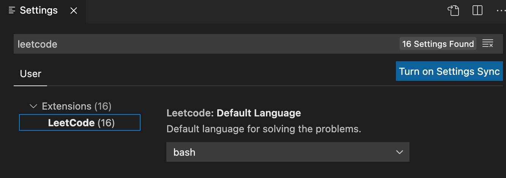

# 0.如何在vscode中优雅的刷LeetCode?(mac)

- [0.如何在vscode中优雅的刷LeetCode?(mac)](#0如何在vscode中优雅的刷leetcodemac)
  - [:link: 下载](#link-下载)
  - [:gear: 配置](#gear-配置)
  - [:keyboard: 使用](#keyboard-使用)
  - [:hole: 当时遇到的一些坑](#hole-当时遇到的一些坑)

## :link: 下载

1. 安装VSCode

2. 安装node

   - pkg下载地址: https://nodejs.org/en/ 
   - 安装完成后在命令行输入:`node -v `查看是否安装成功
   - 默认版本为`14.15`,如果需要别的版本可以自行下载
     - (这里有个坑,具体在后面说明)

3. 在vscode中搜索`leetcode`插件,安装

   

## :gear: 配置

1. 在[leetcode官网](https://leetcode.com/)注册账号（*中美站账号不通用,这里推荐使用美国站*）

2. 设置

   1. 打开vscode设置,并搜索`leetcode`

      
   
   2. 修改默认设置
      
      > 这里推荐修改以下**3**个配置

      - **Leetcode: Default Language** 
        - 可以改为自己经常使用的编程语言
        - 
      - **Leetcode: Endpoint**
        - :heavy_exclamation_mark: 必须注意: 这里根据自己使用的账号修改登录站点,如果是中国站就改为`leetcode-cn`,否则会登录失败
        - 
      - **Leetcode: Workspace Folder**
        - 改为自己的代码存放路径
      
   3. 在vscode中登录leetcode账号(*最困难的一步来惹*)
      1. 在左边的小地球中选择自己登录的站点
         
      2. 在右边的门中选择**cookie登录(:heavy_exclamation_mark:推荐!!)**
         
      3. 在弹窗中输入自己的账号,然后打开[`leetcode官网`](https://leetcode.com/)
      4. 在页面的空白处点击鼠标`右键`,选择`检查`
         
      5. 在右边的控制台中选择`网络`,在左边页面选择`problem`,右下角的模块中就会加载相关信息,点击其中的`all/`和`header`
         
      6. 复制`request header`的`cookie`栏中的全部到vscode中的弹窗中
          
      7. 按`Enter`之后,耐心等待一会儿,就能看到登录成功的界面啦! :tada:
         

## :keyboard: 使用

**主界面**

1. 左侧列表中有各种各样的分类:`difficult/tag/company/favorite`,可以按照自己的需要选择题目
2. 最上面可以直接搜索自己想要的题目:mag:
3. 每一道题目都可以进行收藏:heart:
4. 完成题目后,列表左边会显示:ballot_box_with_check:或:negative_squared_cross_mark:
5. 右边是具体的题目描述,点击右下角的`Code Now`就能开始做题啦!
   
   
   
**做题界面**

1. 此时vscode会默认生成该题的答题模板,该代码会保存在前面设置的工作路径中
2. 在模板中可以看到灰色的小字`submit|test`,点击后可以直接在vscode中检验自己的代码是否正确
   
   

**开始愉快地刷题吧!**

---

## :hole: 当时遇到的一些坑

1. 使用账号无法登陆?
  
   - 登录账号与所选站点不一致,检查vscode设置是否正确 
   - 美国站无法使用账号登录,建议使用**第三方站点或cookie登录** 

2. 无法submit或者test答案?
   
   - 中国站使用账号登录时有几率遇见这样的bug, 主要原因应该是`node@14`版本太高了,换成`node@12`有可能会解决问题(但我没成功😿)
   - 中国区使用`cookie登录`有可能会解决问题(但我依旧没成功😿)
   - 为了避免浪费大量时间,建议直接用`美国站+cookie登录`的方式,一劳永逸!